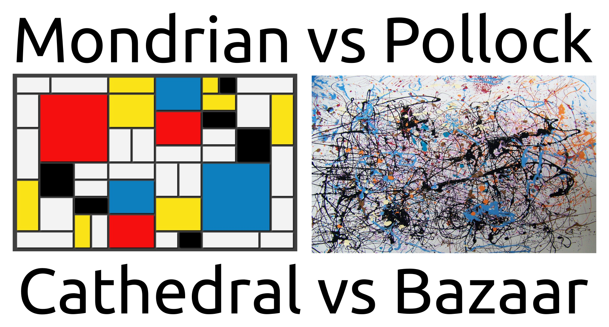
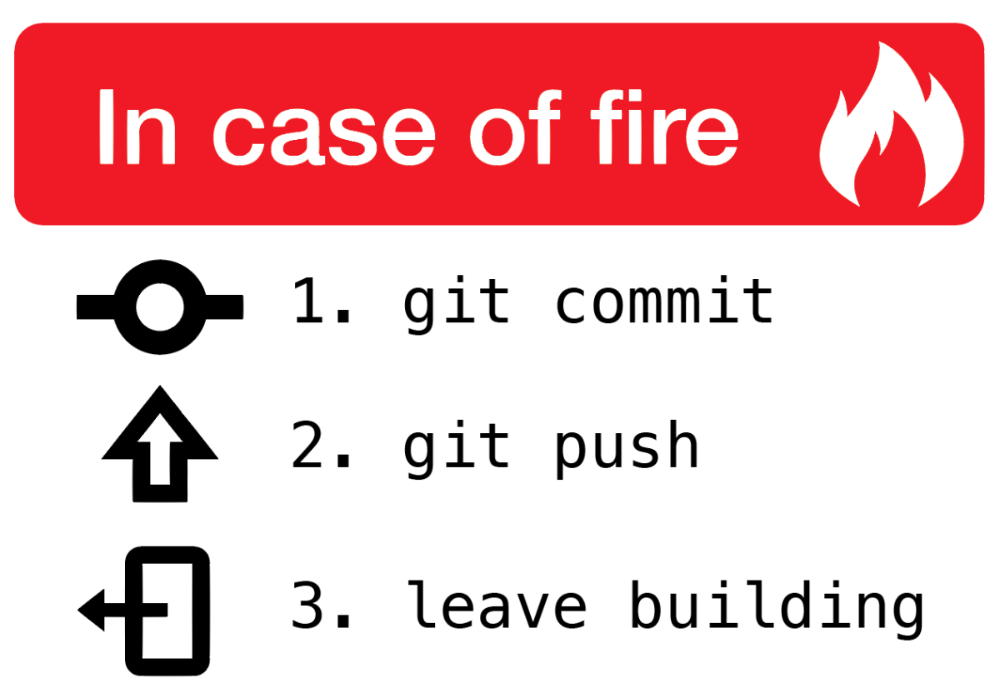

<!--
$size: 16:9

Note:
 * créé en utilisant https://yhatt.github.io/marp/
 * pour les emojis (which can give cancer): http://www.webpagefx.com/tools/emoji-cheat-sheet/
 * disponible sur https://github.com/epfl-dojo/gitro

-->
#
#
#
#
#
#
#
#
#
#  Introduction à Git

<!--
footer: Image Atlassian: https://www.atlassian.com/git/images/atlassian-getting-git-right.jpg -->
###  :space_invader: EPFL Dojo - workshop git
Lausanne, 27 janvier 2017
Nicolas Borboën  :mailbox: <<nicolas.borboen@epfl.ch>>

---
<!--
page_number: true
footer: EPFL Dojo workshop Git — jan 2017 — nbo
-->

# **Git** est un logiciel de gestion de versions décentralisé.

### SVN, CVS, Perforce (centralisés) vs Git, Mercurial, Bazaar (décentralisés)

---
# **Git** est utile (gestion de versions)


---
# Décentralisé ?
<!-- credit image: http://techidiocy.com/understand-git-clone-command-svn-checkout-vs-git-clone/ -->

<!--  C'est à dire que les changements effectués par les utilisateurs sont envoyés à un serveur, et c'est sur se dernier que les autres développeurs vont se synchroniser pour récupérer les changements.
Git lui, est un gestionnaire de version décentralisée, c'est à dire qu'il n'est pas nécessaire de disposer d'un serveur maître pour l'utiliser. Chacun des utilisateurs peuvent se synchroniser entre eux.
http://www-igm.univ-mlv.fr/~dr/XPOSE2008/git/gestionnaires.html
-->

---
# Utilisation locale
<blockquote>La plupart des opérations de Git ne nécessitent que des fichiers et ressources locaux [...] Git vous fera penser que les dieux de la vitesse ont octroyé leurs pouvoirs à Git.</blockquote>

 :bulb: [git-scm.com - Rudiments de Git](https://git-scm.com/book/fr/v1/D%C3%A9marrage-rapide-Rudiments-de-Git#Presque-toutes-les-op%C3%A9rations-sont-locales)

---
# Les tripes de Git

* __objects__ → stockage du contenu `find .git/objects -type f`


* __tree__ → répertoire
* __blob__ → fichier (Binary Large OBject, soit en français : Gros Objet Binaire)
* __commit__ → instantané
* __tag__ → une étiquette pointant toujours sur un même commit


* __refs__ → méchanisme interne pour représenter les branches et les tags

  :bulb: https://git-scm.com/book/fr/v1/Les-tripes-de-Git-Les-objets-Git

---
# Utilisation (initialisation)
* Initialisation d’un dépôt Git dans un répertoire existant
  `$ git init`
  <small>Cela crée un nouveau sous-répertoire nommé .git qui contient tous les fichiers nécessaires au dépôt — un squelette de dépôt Git.</small>
* Récupération d'un dépôt distant dans un dépôt local
  `$ git clone $URI`


  :bulb: https://git-scm.com/book/fr/v2/Les-bases-de-Git-D%C3%A9marrer-un-d%C3%A9p%C3%B4t-Git

---
# Utilisation (modifications dans le dépôt)
* Placer de nouveaux fichiers sous suivi de version  
  `$ git add .`
* Valider vos modifications
  `$ git commit`
  * il ne concerne qu'une chose et une seule ;
  * il est le plus petit possible (tout en restant cohérent).
* Effacer des fichiers  
  `$ git rm`
* Déplacer des fichiers
  `$ git mv`

  :bulb: https://git-scm.com/book/fr/v2/Les-bases-de-Git-Enregistrer-des-modifications-dans-le-d%C3%A9p%C3%B4t

---
# Utilisation (état)
* Vérifier l’état des fichiers
  `$ git status`
* Visualiser l’historique des validations
  `$ git log .`
  * https://coderwall.com/p/euwpig/a-better-git-log


  :bulb: https://git-scm.com/book/fr/v2/Les-bases-de-Git-Visualiser-l%E2%80%99historique-des-validations


---
# Utilisation (branches)
<!-- https://www.miximum.fr/blog/enfin-comprendre-git/ -->
Une branche n'est qu'une étiquette qui pointe vers un commit.
Elle permet d'avoir des environnements de développement facilement (feature, bug fix)

  :bulb: https://git-scm.com/book/fr/v1/Les-branches-avec-Git-Travailler-avec-les-branches

---
# Utilisation (flow)
L'utilisation des branches peut-être liées à des bonnes pratiques, par exemple :
* https://leanpub.com/git-flow/read
* http://nvie.com/posts/a-successful-git-branching-model/

---
# Utilisation (conflits)
Lors qu'un fichier est modifié par un autre utilisateur, ou que vous voulez fusionner deux branches, il arrive qu'il soit nécessaire de résoudre des conflits.

Afin de pouvoir résoudre les conflits visuellement, il existe des outils adéquats, par exemple [Meld](http://meldmerge.org/).
Pour définir l'outils utilisé pour résoudre les conflits, utiliser la commande:
   `$ git config merge.tool meld`

---
# Pratique


---
# Pratique
1. Installation git [:bulb:doc](https://git-scm.com/book/fr/v2/D%C3%A9marrage-rapide-Installation-de-Git)
2. Configuration de l'utilisateur [:bulb:doc](https://git-scm.com/book/fr/v2/D%C3%A9marrage-rapide-Param%C3%A9trage-%C3%A0-la-premi%C3%A8re-utilisation-de-Git)  
  `$ git config --global user.name "John Doe"`
  `$ git config --global user.email johndoe@example.com`
* Créer un dépôt local `$ git init` dans un répertoire
* Manipulation:
  * création fichier, édition fichier ;
  * `$ git add fichier` "Staging aera"
  * `$ git commit -m"mon message de log" fichier` "Repository aera"
* Utiliser `$ git status` entre les étapes

---
# Pratique


---
# Pratique
* Créer un conflit
  * Modifier un fichier et le commiter
  * Création d'une branche sur le répertoire courant et switcher dessus
  `$ git checkout -b maBranche`
  * Editer les mêmes lignes du fichier dans la branche et le commiter
  * Retrouner sur la branche `master` : `$ git checkout master`
  * Fusionner `maBranche` dans `master` : `$ git merge maBranche`
  * Identifier le conflit avec `$ git status`
  * Résoudre le conflit, par exemple avec [Meld](http://meldmerge.org/)

---
# Pratique (conflits)
```
~/gitTest(branch:master) » git merge maBranche                      
Auto-merging fichier
CONFLICT (content): Merge conflict in fichier
Automatic merge failed; fix conflicts and then commit the result.
```
* Ouvrir l'outil de résolution de conflits :  
  `$ git mergetool`
* Résoudre les conflits (le fichier central est le fichier final)
* Utiliser `$ git add fichier` et `$ git commit -m"Merge"`
  ⇒ conflits résolus

---
# Pratique (conflits)

* Utiliser une commande pour voir le graph des commits, par exemple:
  * `$ git log --graph` ou `$ git log --graph --oneline --decorate --all`
  * `$ gitk`
  
  * [GitKraken](https://www.gitkraken.com)
    
  ou autres GUI https://git-scm.com/download/gui/

---
# Conclusion
<span>&nbsp; &nbsp; &nbsp; &nbsp; </span>    <span>&nbsp; &nbsp; &nbsp; &nbsp; &nbsp; &nbsp; &nbsp; &nbsp; </span>

---
# Ressources [1]
* Starter Pack
  * Le site officiel : https://git-scm.com/
    * Les multiples clients : https://git-scm.com/downloads
    * Les pages de documentation : https://git-scm.com/doc
    * Le livre, en français : https://git-scm.com/book/fr/
  * [Juste un petit guide pour bien démarrer avec git. no deep shit ;)](http://rogerdudler.github.io/git-guide/)  
    Un site sur une page résumant le nécessaire pour débuter.

---
# Ressources [2]
* Cours
  * [Learn Git in 7 minutes](http://www.codingdojo.com/blog/git-tutorial-for-beginners/)  
    Un tutorial pour débutant avec une vidéo et une infographie.
  * [CodeSchool](https://www.codeschool.com/courses/try-git) / [GitTry](https://try.github.io)  
    Les tutos officiels pour Git.
  * [Learn Git Branching](http://learngitbranching.js.org/)  
    Un super site avec rendu visuel pour mieux comprendre le fonctionnement des branches.
* Intro
  * https://github.com/sdfepfl/git-basics
  * https://c4science.ch/source/git-demo/
---
# Ressources [3]
* Divers
  * http://think-like-a-git.net/
  * http://marklodato.github.io/visual-git-guide/index-fr.html
  * https://help.github.com/articles/git-and-github-learning-resources/
  * http://danielkummer.github.io/git-flow-cheatsheet/index.fr_FR.html
  * http://www.askaswiss.com/2016/01/12-useful-advanced-git-commands.html
  * https://www.miximum.fr/blog/enfin-comprendre-git/

---
# Ressources [4]
* Awesome
  * https://github.com/dictcp/awesome-git
  * https://github.com/git-tips/tips

---
# Ressources [5]
* Cheat Sheets
  * https://services.github.com/on-demand/downloads/fr/github-git-cheat-sheet.pdf
  * http://rogerdudler.github.io/git-guide/files/git_cheat_sheet.pdf
  * https://github.com/arslanbilal/git-cheat-sheet
  * https://www.git-tower.com/blog/git-cheat-sheet/
  * https://www.atlassian.com/dms/wac/images/landing/git/atlassian_git_cheatsheet.pdf
  * http://www.cheat-sheets.org/saved-copy/git-cheat-sheet.pdf

---
# Ressources [6]
* Infographie
  * [Learn Git in 7 minutes](http://www.codingdojo.com/blog/wp-content/uploads/Learn_Github_ArtEnhanced.jpg)
  * https://github.com/aaasen/github_globe

---
# A propos :bulb:
Cette présentation a été faite avec le logiciel [Marp](https://yhatt.github.io/marp/) — Markdown Presentation Writer — dans le cas des dojos de programmation pour les apprentis informaticiens de l'[EPFL](http://www.epfl.ch).

Ces slides sont disponibles sur le dépot [gitro — une petite introduction à Git](https://github.com/epfl-dojo/gitro) [https://github.com/epfl-dojo/gitro].


